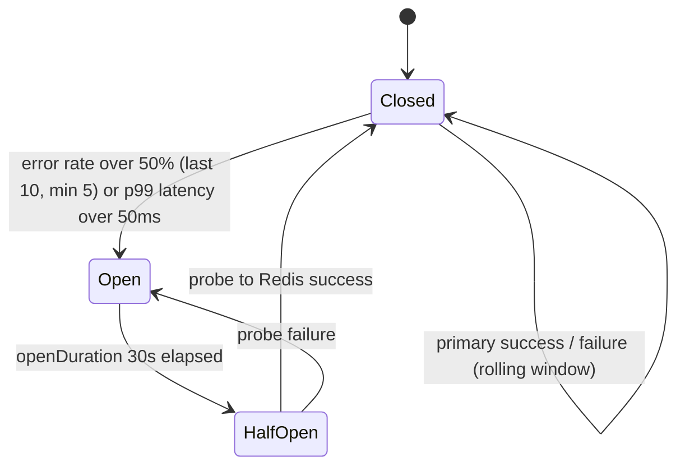

# Distributed rate limiter (v2)

[](https://github.com/shubhamjain2908/distributed-rate-limiter-v2/actions/workflows/go.yml)

HTTP service with a **hexagonal** `Limiter` port, **Redis + Lua (EVALSHA)** as the distributed primary, **in-memory token bucket** as the local fallback, and a **3-state circuit breaker** around the Redis path. Prometheus SLOs (decisions, Redis p99, circuit, fallback, **error budget**), Grafana provisioning, and docker-compose for local full-stack runs.

## Run

```bash
export REDIS_ADDR=127.0.0.1:6379   # optional: omit for in-process limiter only
go run ./cmd/server
```

**Docker (app + redis + prometheus + grafana):**

```bash
docker compose up -d
open http://localhost:3000   # Grafana: admin / admin
open http://localhost:9090   # Prometheus
```

The server uses `COST_CONFIG_PATH` (default `config/cost_config.yaml`) to price routes; per-request overrides: `X-Request-Cost`, `X-Rate-Limit-Cost`, and `X-Client-ID` as the limiter key.

### Load testing (Grafana + Prometheus)

**Single request (compose default `8080:8080`, `X-Client-ID` per-client bucket):**

```bash
curl -sS -D- -H 'X-Client-ID: my-client' 'http://127.0.0.1:8080/' -o /dev/null | head
```

**Sustained traffic:**

```bash
./scripts/loadtest.sh
# optional:  ./scripts/loadtest.sh 'http://127.0.0.1:8080' 50 20000
```

**Heavier load (e.g. [hey](https://github.com/rakyll/hey)):**

```bash
go install github.com/rakyll/hey@latest
hey -n 200000 -c 80 -H 'X-Client-ID: demo' 'http://127.0.0.1:8080/'
```

Prometheus scrapes `/metrics` every **5s** (`prometheus.yml`). In Grafana, the **28d** error-budget query uses a long `increase()` window on counters; **`ratelimiter_error_budget_remaining`** (process-lifetime) updates immediately from the same app process.

## Target SLOs (the numbers we build toward)

| Target | Value |
|--------|--------|
| p99 for Redis allow/deny (EVALSHA) | &lt; **2ms** (histogram `ratelimiter_redis_duration_seconds`) |
| **Circuit** trip to Open after Redis is unavailable | &lt; **~100ms** to first *successful* degraded response (local path); Open state + metrics follow after **5** failed primary attempts (rolling error-rate) |
| **0** data races | `go test -race ./...` clean |
| **1M+ req/min** on a 2-CPU container | Achievable on the **local fallback** (in-process token bucket); the Redis path is **network** + single-threaded Lua (see [DESIGN.md](DESIGN.md)) |

*Production numbers depend on host, colocation, p99 load, and shard topology.*

## Algorithm choice: token bucket vs sliding window

| | **Token bucket** (default here: Redis script + local fallback) | **Sliding window** (`SlidingWindow` in repo) |
|---|----------------------------------------------------------------|---------------------------------------------|
| **When to use** | Smooth bursts with refill, predictable “remaining tokens” semantics, cheap Redis/Lua (O(1) state) | **Strict** “N events per T” windows; clearer audit of “last window” behavior |
| **State per client** | 2 numbers (tokens, last time) in Redis; same locally | Grows with **event count in window** — prune on each allow (slice of timestamps) |
| **Memory trade-off (in-process)** | O(clients) maps + 2 floats per client | O(clients) + O(events per client in window) — can dominate RAM when windows are long or keys are many |
| **This service** | Primary (Lua) and fallback use token-bucket math | Use when you add a sliding-window **adapter** (not wired as primary in `cmd/server` today) |

## Performance (benchmarks)

Run locally:

```bash
make bench
# Optional: real Redis (dev instance only; DB 15 is flushed in the wire bench)
REDIS_BENCH_ADDR=127.0.0.1:6379 go test -bench=Wire -benchmem -count=3 -run=^$ ./internal/redis/...
```

**RPS in production** = aggregate requests per second (many app goroutines, many client IDs) is higher than a **single-threaded** `Allow` loop. **Redis CPU%** = `top` or `docker stats` on the `redis-server` process. Miniredis throughput is *not* comparable to a real `redis:7` socket (see [DESIGN.md](DESIGN.md)).

### One real wire-Redis row (laptop, self-measured)

*Reproduce after starting Redis 7 (e.g. `docker run -p 6379:6379 redis:7-alpine`):*

```bash
export REDIS_BENCH_ADDR=127.0.0.1:6379
# Throughput: mean op time from the official wire benchmark
go test -bench=BenchmarkRedisLimiter_Wire_Cost1 -benchtime=2s -count=5 -run=^$ ./internal/redis/...
# p50 / p99 of individual Allow() RTTs (n=20,000, same one-client setup as the bench)
go test -v -run TestWireAllow_MeasureOneClient -count=1 ./internal/redis/...
```

| **Scenario** | **~RPS** (single goroutine) | **p50** (Redis) | **p99** (Redis) | **Redis CPU** * | **Where / when** |
|--------------|----------------------------:|-----------------|-----------------|------------------|------------------|
| **Wire `EVALSHA`, loopback** | **~4.5k** (≈1 / 220 µs/op) | **0.20 ms** | **0.39 ms** | n/a (local Docker) | **Apple M2 Pro**, **Redis 7** (Docker → `127.0.0.1:6379`), Apr 2026, `go1.25`; mean of 5× `BenchmarkRedisLimiter_Wire_Cost1` runs; p50/p99 from `TestWireAllow_MeasureOneClient` |

*Single-client, single `Allow` path. Higher end-to-end RPS is expected with many parallel `Allow` calls and more CPU cores; this row is a **credible** baseline, not a marketing ceiling.*

| Scenario (indicative) | Approx RPS | p50 (Redis) | p99 (Redis) | Redis CPU% (illustrative) | Notes |
|----------------------|------------|------------|------------|-----------------------------|--------|
| Local token bucket, 1 goroutine | **~10⁷–10⁸ /s** (see `BenchmarkTokenBucket_*`) | — | — | 0% | In-process, no I/O; **1M+ req/min** on 2-CPU is achievable (CPU- and mutex-bound, not algorithm-bound). |
| Redis path, miniredis (default `make bench`) | **~5–8k** | n/a | n/a | n/a | In-process gopher-lua; **for regression / CI** only, not real Redis. |
| 1k+ concurrent *logical* clients in prod | (many × single-path RPS, minus coordination) | (Grafana) | (Grafana) | scales with load | Observe with `ratelimiter_redis_duration_seconds` + `top`. |

*Prometheus in this service: `histogram_quantile(0.5|0.99, sum(rate(ratelimiter_redis_duration_seconds_bucket[5m])) by (le))` (see Grafana dashboard).*

## Circuit breaker (state machine)



*Implementation: `internal/circuitbreaker` — lock-free FSM read on `Route()`, rolling outcomes + latency in mutex.*

**Demo: trip + recovery**

- `make trip-test` — `scripts/trip-test.sh` stops the compose **redis** service, checks the **first** post-failure request completes quickly (default **&lt;100ms**; override `TRIPTEST_FIRST_MAX_MS`), hammers 5 failed primaries to trip **Open**, then restarts Redis and, after the **30s** open window, expects `X-Rate-Limit-Algorithm: redis` again. Requires **Docker** + this repo’s `docker compose` stack.
- SLOs on `/metrics`: `ratelimiter_circuit_state`, `ratelimiter_fallback_decisions_total`, `ratelimiter_redis_duration_seconds`.

## Grafana: error budget

- Dashboard JSON: [`grafana/dashboards/slo-dashboard.json`](grafana/dashboards/slo-dashboard.json) — **panel 5/6** plot `ratelimiter_error_budget_remaining` and the 28d PromQL variant from `ratelimiter_slo_{requests,errors}_total`.
- A **static** illustration: [`docs/images/error-budget-gauge.svg`](docs/images/error-budget-gauge.svg). For a real “gauge screenshot”, open Grafana (compose), open the **“Rate Limiter SLO + promhttp”** dashboard, focus the **SLO: error budget** row, and **Share → Image / Export**.

## Testing

```bash
make race              # all packages, race detector (required: 0 reports)
go test -tags=integration -race ./internal/redis/...   # Docker: real Redis
```

**CI:** [`.github/workflows/go.yml`](.github/workflows/go.yml) runs `go test -race ./...` on every push and pull request. *Never ship changes that add races — reviewers and CI use the same command.*

## Make targets

| Target | Purpose |
|--------|--------|
| `make test` | Unit tests |
| `make race` | `go test -race` |
| `make integration` | `go test -tags=integration` (Testcontainers) |
| `make bench` | In-process + miniredis microbenchmarks |
| `make wire-measure` | `REDIS_BENCH_ADDR=…` — re-run wire RPS + p50/p99 test (refreshes README table) |
| `make trip-test` | Redis kill / fallback / recovery (Docker) |

## License / module

`github.com/shubhamjain2908/distributed-rate-limiter-v2`
